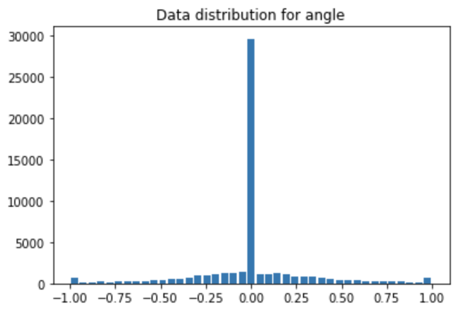
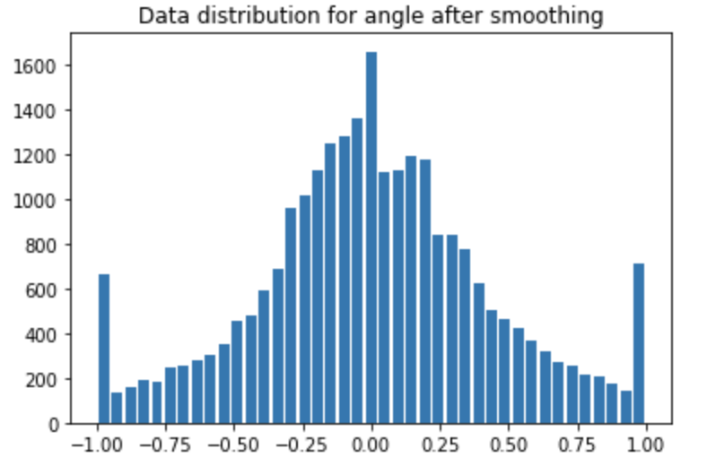
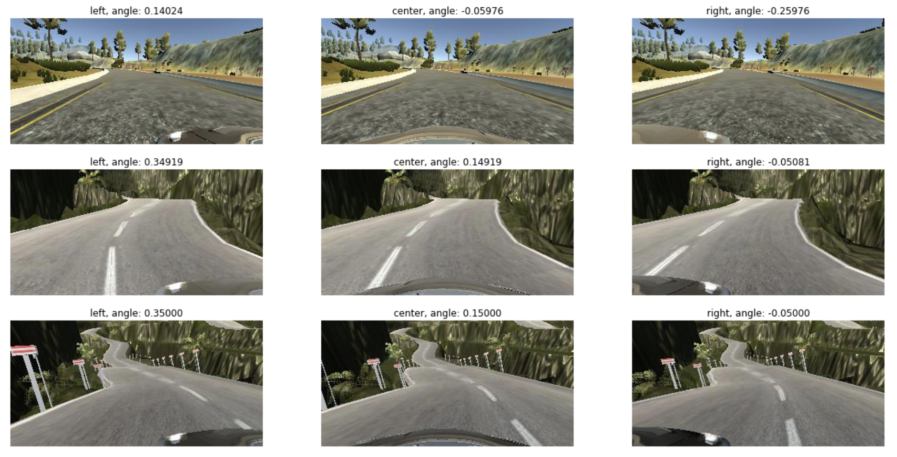
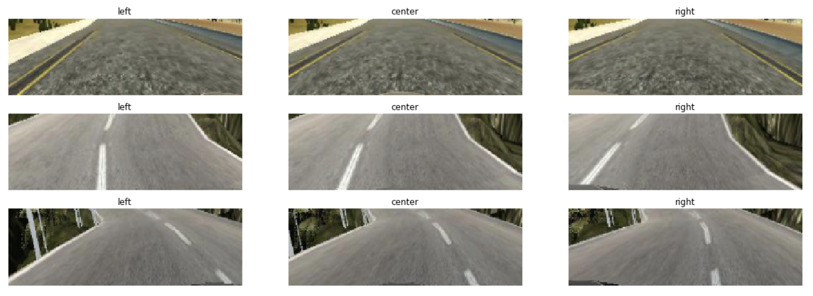
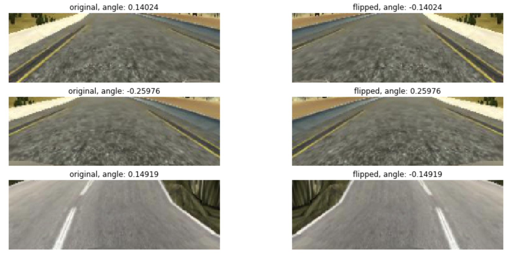
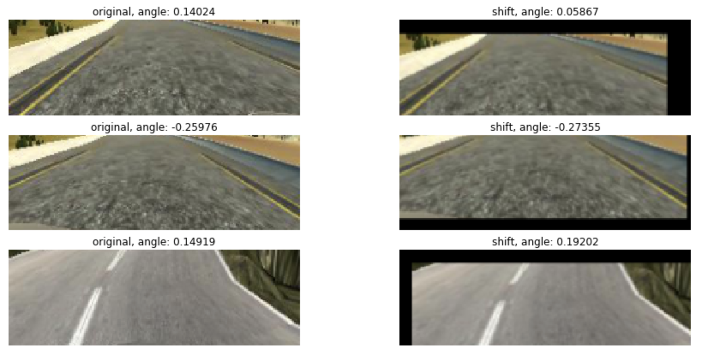

# **Behavioral Cloning**

---

The goals / steps of this project are the following:
* Use the simulator to collect data of good driving behavior
* Build, a convolution neural network in Keras that predicts steering angles from images
* Train and validate the model with a training and validation set
* Test that the model successfully drives around track one without leaving the road
* Summarize the results with a written report

---

### Reflection

#### Data

##### 1. Data collection
I recorded 4 laps for each clockwise and counter-clockwise driving for each track(track 1 and track 2).
I also used the data Udacity provided.

##### 2. Data smoothing
Here is the data distribution for angle.

The data is biased toward 0 angle. So I discarded most of the data for 0 angle.

##### 3. Data Preprocessing & Data Augmentation
* As Udacity recommended, I used not only center images, but also left and right images(the angles are adjusted by ±0.2 for left/right images).

* The images are cropped(the sky and car front parts are removed) and resized to 66×200.

* The images are normalized so they have zero mean(-0.5~0.5).

* The images are flipped horizontally.

* The images are randomly shifted horizontally/vertically.

 

#### Model Architecture and Training

##### 1. Model Architecture

The model is based on the NVIDIA model. Here is the architecture.

 

| Layer             |     Description	        					          |
|:-----------------:|:-------------------------------------------:|
| Input         		| 66x200x3 RGB image   							          |
| Normalization     |                     							          |
| Convolution 5x5   | 2x2 stride, valid padding, outputs 31x98x24 |
| RELU					    |												                      |
| Convolution 5x5  	| 2x2 stride, valid padding, outputs 14x47x36	|
| RELU					    |												                      |
| Convolution 5x5  	| 2x2 stride, valid padding, outputs 5x22x36	|
| RELU					    |												                      |
| Convolution 3x3  	| 1x1 stride, valid padding, outputs 3x20x64	|
| RELU					    |												                      |
| Convolution 3x3  	| 1x1 stride, valid padding, outputs 1x18x64	|
| RELU					    |												                      |
| Fully connected		| outputs 100        									        |
| RELU					    |												                      |
| Fully connected		| outputs 50       									          |
| RELU					    |												                      |
| Fully connected		| outputs 10        									        |
| RELU					    |												                      |
| Fully connected		| outputs 1        				  					        |

##### 2. Training

Here are the techniques/parameters I used in the training.

* Optimizer: Adam
* Learning rate: 0.0001
* Batch size: 32
* Early stopping/Checkpoint

I used Adam optimizer and set learning rate a bit low in order for validation error not to stop improving so early.
I guess data augmentation also mitigated the effect of overfitting so I didn't use any regularization techniques like dropout or L2 regularization.

For each epoch, 20000 samples are used for training, 4480 samples are used for validation.

When the validation error doesn't seem to improve anymore, early stopping automatically stops the training process and checkpoint function saves the best model/weights in terms of the validation error.

 

#### Results

| Track 1                  | Challenge Track          					          |
|:------------------------:|:--------------------------------------------:|
|||
